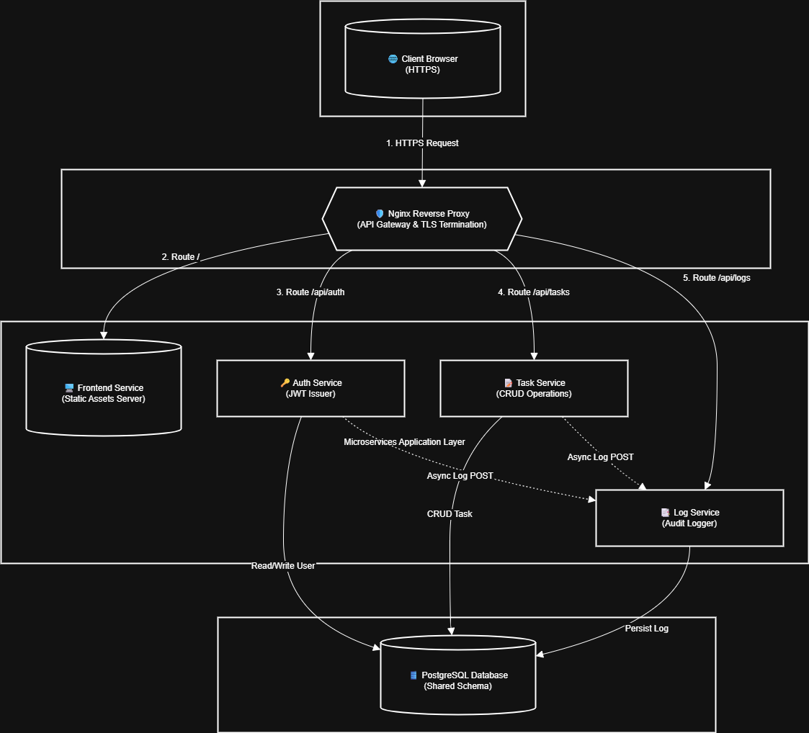

# 🚀 Task Board Microservices Project (Set 1)
### รายงานการพัฒนาระบบจัดการกระดานงานภายใต้สถาปัตยกรรมไมโครเซอร์วิส

---

## 👥 ข้อมูลผู้จัดทำ
| รายชื่อสมาชิก | รหัสนักศึกษา | บทบาทหลัก |
|:---|:---:|:---|
| **พชร จันทร์ยวง** | 67543210039-3 | Full-stack & DevOps Integration |
| **ชัยมนัส วัฒนปรีดา** | 67543210069-0 | Full-stack & DevOps Integration |

---

## 📝 1. ภาพรวมของระบบ (Project Overview)
โปรเจกต์นี้เป็นการพัฒนาระบบจัดการงาน (Task Board) โดยใช้สถาปัตยกรรม **Microservices** เพื่อศึกษาการแยกส่วนการทำงาน (Decoupling) และการสื่อสารระหว่างเซอร์วิสผ่าน API Gateway (Nginx) โดยมีวัตถุประสงค์หลักคือ:
* **Scalability:** เพื่อสร้างระบบที่ยืดหยุ่นและขยายตัวได้ง่าย
* **Security:** นำมาตรฐาน HTTPS และ JWT มาใช้ในการรับส่งข้อมูลอย่างปลอดภัย
* **Observability:** ศึกษาระบบ Centralized Logging เพื่อติดตามเหตุการณ์ในระบบ

---

## 🏗️ 2. Architecture Diagram & Flow


### **สถาปัตยกรรมเครือข่าย (System Flow)**
```text
Browser / Postman
       │
       │ HTTPS :443 (HTTP :80 redirect → HTTPS)
       ▼
┌─────────────────────────────────────────────────────────────┐
│  🛡️ Nginx (API Gateway + TLS Termination + Rate Limiter)    │
│                                                             │
│  /api/auth/* → auth-service:3001    (Public)               │
│  /api/tasks/* → task-service:3002   [JWT Required]          │
│  /api/logs/* → log-service:3003    [JWT Required]          │
│  /             → frontend:80         (Static HTML)          │
└───────┬────────────────┬──────────────────┬─────────────────┘
        ▼                ▼                  ▼
┌──────────────┐ ┌───────────────┐ ┌──────────────────┐
│ 🔑 Auth Svc  │ │ 📋 Task Svc   │ │ 📝 Log Service   │
│    :3001     │ │    :3002      │ │    :3003         │
└──────┬───────┘ └───────┬───────┘ └────────┬─────────┘
       └────────┬────────┴──────────────────┘
                ▼
      ┌─────────────────────┐
      │  🗄️ PostgreSQL       │
      │  (1 Shared DB)      │
      └─────────────────────┘
---

### 3. โครงสร้าง Repository (Repository Structure)
final-lab-set1/
├── auth-service/       # ระบบยืนยันตัวตนและออก JWT
├── task-service/       # ระบบจัดการ Task CRUD
├── log-service/        # ระบบบันทึก Log กลาง
├── nginx/              # ไฟล์ตั้งค่า Nginx (HTTPS + Reverse Proxy)
├── frontend/           # ส่วนหน้าบ้าน (Static HTML/JS/CSS)
├── db/                 # init.sql (Schema + Seed Users)
├── scripts/            # gen-certs.sh (สร้าง Self-signed cert)
├── screenshots/        # หลักฐานการทดสอบระบบ (01-12)
├── docker-compose.yml  # ไฟล์สั่งรัน Container ทั้งหมด
├── TEAM_SPLIT.md       # สรุปการแบ่งงาน
└── INDIVIDUAL_REPORT.md # รายงานรายบุคคล

---

### 4. วิธีการรันระบบ (Setup & Deployment).
การสร้าง SSL Certificate
ใช้คำสั่งด้านล่างเพื่อสร้างไฟล์ใบรับรองสำหรับการใช้งาน HTTPS บน Nginx:

Bash
openssl req -x509 -nodes -days 365 -newkey rsa:2048 \
-keyout nginx/ssl/nginx.key -out nginx/ssl/nginx.crt
การรันระบบด้วย Docker Compose
Bash
docker compose up --build
URL: https://localhost

---
### 5. รายชื่อ Seed Users สำหรับทดสอบ
Email,Password,Role
admin@example.com,password123,Administrator

หมายเหตุ: ระบบใช้การตรวจสอบรหัสผ่านและออก Token ผ่าน Auth Service โดยมีการจัดการข้อมูลเบื้องต้นผ่าน SQL Script ในขั้นตอน Build ระบบ
---
### 6. วิธีการทดสอบระบบ (Testing Guide)
Frontend: ทดสอบการ Login และใช้งานฟังก์ชันจัดการ Task (Create, Read, Update, Delete) ผ่านหน้าจอ UI

API Testing: ทดสอบการส่ง Request โดยแนบ Token ใน Header:

HTTP
Authorization: Bearer <JWT_TOKEN>
---
###  7. คำอธิบายทางเทคนิค
HTTPS: ป้องกันการดักจับข้อมูล (Man-in-the-Middle) ผ่านการตั้งค่า TLS บน Nginx

JWT: ระบบ Stateless Authentication โดย Auth Service จะออก Token ที่บรรจุข้อมูล id และ role เพื่อให้เซอร์วิสอื่นใช้ตรวจสอบสิทธิ์

Logging: ออกแบบเป็น Lightweight Logging โดยทุกเซอร์วิสจะส่งเหตุการณ์สำคัญไปยัง Log Service ผ่าน HTTP POST
---
### 8. ข้อจำกัดของระบบ (Known Limitations)
Shared Database: ยังใช้ PostgreSQL ร่วมกัน (ในระบบจริงควรแยก Database ต่อ Service)

SSL Certificate: เป็นแบบ Self-signed ซึ่งเบราว์เซอร์จะแจ้งเตือนความปลอดภัย

Token Lifecycle: ยังไม่มีระบบ Refresh Token